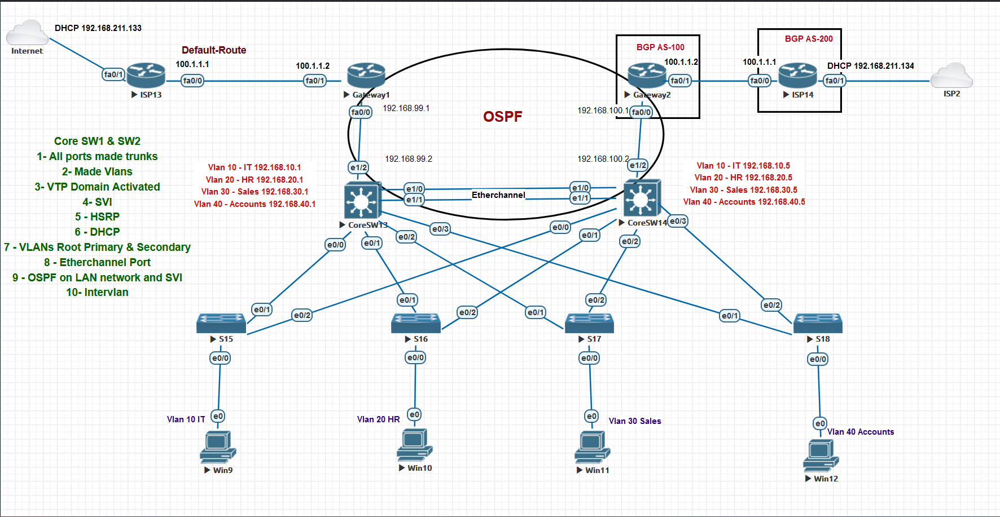

# CCNA Networking Lab - Enterprise Network Design & Implementation

## Overview
This project demonstrates a **comprehensive CCNA-level enterprise network design**, focusing on **network topology, configuration, verification, and testing**.  
The lab simulates a real-world enterprise environment using multiple switches, routers, VLANs, routing protocols, and redundancy mechanisms.

The objective of this project was to design a **scalable, redundant, and well-segmented network**, implement the required configurations, and verify end-to-end connectivity.

---

## Technologies & Concepts Used
- Cisco Switching & Routing (CCNA level)
- VLANs & Trunking
- Inter-VLAN Routing (SVI)
- VTP (VLAN Trunking Protocol)
- EtherChannel
- HSRP (Hot Standby Router Protocol)
- OSPF (Open Shortest Path First)
- DHCP
- BGP (Basic external connectivity simulation)
- Redundant network design
- Network verification & testing

---

## Network Topology Overview
The network is designed using a **three-tier architecture**:
- **Core Layer** - Core switches providing routing, redundancy, and inter-VLAN communication
- **Access Layer** - Access switches connecting end devices
- **Edge / ISP Layer** - Simulated ISP connectivity using routing protocols

### Key Design Highlights
- Multiple VLANs for departmental segmentation
- Redundant core switches with HSRP
- EtherChannel between core switches for high availability
- OSPF for internal routing
- Simulated ISP connectivity using BGP
- DHCP for dynamic IP assignment

---

## VLAN Design
| VLAN ID | Department | Subnet |
|------|------------|--------|
| VLAN 10 | IT | 192.168.10.0/24 |
| VLAN 20 | HR | 192.168.20.0/24 |
| VLAN 30 | Sales | 192.168.30.0/24 |
| VLAN 40 | Accounts | 192.168.40.0/24 |

Each VLAN is configured with:
- SVI on core switches
- HSRP for gateway redundancy
- DHCP for host addressing

---

## Implementation Details

### Step 1: Core Switch Configuration
- All ports configured as trunks
- VLANs created and propagated using VTP
- SVIs configured for inter-VLAN routing
- HSRP configured for default gateway redundancy
- DHCP services configured for VLANs
- EtherChannel configured between core switches

---

### Step 2: Access Switch Configuration
- Trunk links to core switches
- Access ports assigned to appropriate VLANs
- Redundant uplinks to ensure high availability

---

### Step 3: Routing Configuration
- OSPF configured on LAN interfaces and SVIs
- Default routes advertised
- External routing simulated using BGP between gateways and ISPs

---

### Step 4: End Device Configuration
- End devices connected to access switches
- IP addresses assigned dynamically via DHCP
- VLAN membership verified

---

## Verification & Testing
The network was verified using:
- `ping` between hosts in different VLANs
- `show vlan brief`
- `show ip route`
- `show etherchannel summary`
- `show standby` (HSRP verification)
- OSPF neighbor checks
- End-to-end connectivity testing

All VLANs were able to communicate successfully using inter-VLAN routing.

---

## Results
- Successful inter-VLAN communication
- Redundant gateway functionality confirmed
- High availability achieved using EtherChannel and HSRP
- Dynamic routing verified with OSPF
- Enterprise-grade network behaviour demonstrated

---

## Screenshots

### CCNA Enterprise Network Topology

---

## Configuration Files

The complete lab configuration files are available for download below:

**CCNA Lab Configuration Files (EVE-NG / UNetLab Export)**  
👉 [Download configuration ZIP](configs/ccna-lab-configs.zip)

These files include:
- Device configurations
- Lab topology export
- Switch and router setup used in this project

---

## Key Learnings
- Enterprise network design principles
- VLAN segmentation and trunking
- Redundancy using HSRP and EtherChannel
- Dynamic routing with OSPF
- Troubleshooting complex network topologies
- Verification and testing methodologies

---

## Future Enhancements
- Implement ACLs for traffic filtering
- Add network security features
- Extend BGP configuration
- Convert to a full CCNP-style lab
